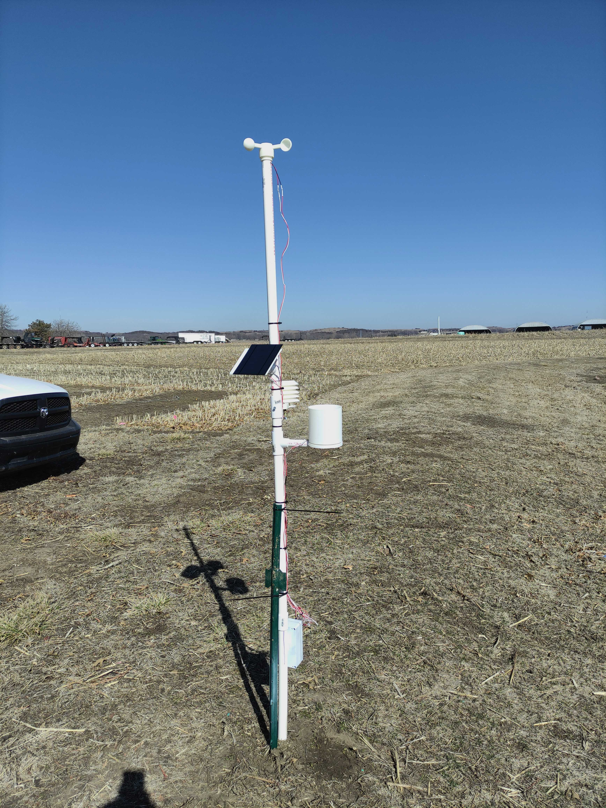
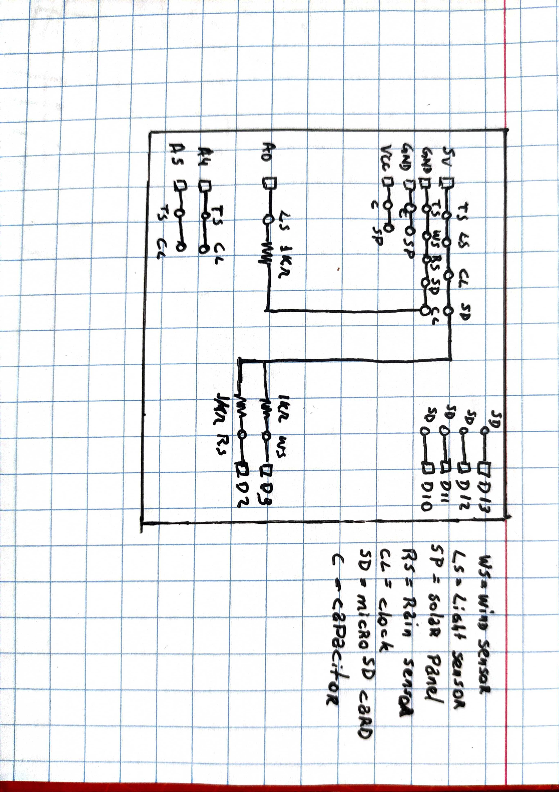

# Weather Station

## List of Contents

1. [Objective](#objective)
2. [Weather Station working flow](#weather-station-working-flow)
3. [List of Materials](#list-of-materials)
4. [Circuit Board](#circuit-board)
5. [Algorithm](#algorithm)
6. [3D Files](#3d-files)
7. [Structure](#structure)
8. [Future works](#future-works)

---

## Objective
Develop a weather station to collect air temperature and humidity, luminosity, wind speed and precipitation in field using Arduino and sensors. It is energized with a solar panel and batteries. All data is saved in a microSD card along with the date and time.

---

## Weather Station working flow
Into a loop that repeats every 1 minute, the sensors get the data values and store into a .txt file. The .txt file is in the microSD card. Along with the sensors' reading data, the date and time is also sent to the .txt file.

The final .txt file is a line per reading with date, hour and sensors' data, all separated by commas.

---

## List of Materials

| Belongs to | Material | Amount |
|----------- | ----------- | ----------- |
| Main Board | Arduino Uno | 1 |
| Main Board | microSD card module | 1 |
| Main Board | 32 GB microSD card | 1 |
| Main Board | RTC module DS3231 + battery | 1 |
| Main Board | Wires for connections | X |
| Main Board | Arduino enclosure | 1 |
| Rain Sensor | 3D structures in ABS | X |
| Rain Sensor | Rod of 3mm diameter and 30mm length (steel, aluminium...) possibly a little filed down to reduce to 2.95mm | 1 |
| Rain Sensor | Reed switch 1.8x7mm | 1 |
| Rain Sensor | 1k Ohm resistor | 1 |
| Rain Sensor | Round neodymium magnet 4x2mm | 1 |
| Rain Sensor | Bolts M3x6mm | 2 |
| Rain Sensor | Bolts or screws to fix the base on your support | 4 |
| Rain Sensor | Wires to connect to the reed switch | X |
| Rain Sensor | Glue to fix the magnet | A drop |
| Temperature & Humidity Sensor | AHT10 Sensor | 1 |
| Temperature & Humidity Sensor | 3D structures in ABS | X | 
| Temperature & Humidity Sensor | Bolts 10.5x0.5 cm and sow | 3 |
| Temperature & Humidity Sensor | Bolt to fix the sensor in place | 1 |
| Temperature & Humidity Sensor | Wires | X |
| Wind Sensor | Reed Switch 2x14mm | 1 |
| Wind Sensor | 1k Ohm resistor | 1 |
| Wind Sensor | Wires | X |
| Wind Sensor | 3D structures in ABS | X |
| Wind Sensor | Sealed bearing, 5 mm ID, 8mm OD, 2.5mm thick | 1 |
| Wind Sensor | Rod for the bearings 5mm OD | 1 |
| Wind Sensor | 1k ohm resistor | 1 |
| Structure | PVC pipe | 235cm x 4.83cm diameter |
| Structure | PVC pipe | 20cm x 3.34cm diameter |
| Structure | PVC pipe | 10cm x 2.66cm diameter |
| Structure | T junction / Reduction of 4.83cm to 3.34cm diameter | 2 |
| Structure | T junction / Reduction of 4.83cm to 2.66cm diameter | 1 |
| Energy | Capacitor of 100uF and 16V | 1 |
| Energy | Diode 1n4007 | 1 |
| Energy | Panel with minimum 4Wp, 0.48A and 9V | 1 |
| Energy | Rechargeable battery of 0.3 Ah | 1 |
| Energy | Wires | X |
| Light Sensor | LDR 5mm | 1 |
| Light Sensor | 1k Ohm resistor | 1 |
| Light Sensor | Wires | X |

 

---

## Circuit Board
A circuit board were made to make everything more organized and avoid wrong connections and wires out of place. The schema of the circuit board can be seen bellow:

The .dxf file containing the circuit board's draw is in the folder Circuit_Board.

---

## Algorithm
The algorithm was made in C++ using Arduino IDE, since it is for Arduino. It is located in the Algorithm/Programa_o folder. The algorithm is structured as followed:
- Inclusion of libraries for SD card, RTC clock, temperature and humidity sensor;
- Declaration of variables for each sensor and module;
- Setup, that only runs once when the Arduino is restarted. On this function, i) the pin for the Pluviomether and Anemomether reed switchs' are declared; ii) initialize the microSD card; iii) the clock is initialized and adjusted only once; iV) the temperature and humidity sensor is initialized;
- Loop, that keep running. On this function, i) The super delay function is inserted to work every 5 minutes, ii) the Anemomether data (wind speed) is collected and adjusted, iii) the luminosity data is collected and adjusted, iv) temperature and humidity data is collected, v) the Pluviomether data is collected (rain) and adjusted, vi) Date and Time variables are collected and stored, vii) the .txt file in the microSD card is opened and all variables are stored into it, closing the .txt after that;
- Super delay function. It is created to take readings of rain and wind at everytime and just after a time, saves the data in the microSD card. To count the rain and wind, it verifies the state of the reed switch, and if it was changed, it is counted and the value changes.

---

## 3D Files
The main 3D files were all gotten at Thingiverse website, having different authors. The support 3D files were designed by the author in Fusion360 software.
### Anemomether
There are structures siliar to spoons that "collect" the wind, moving the axis attached to it. In the moving structure, there is a magnet that moves in the same speed as the spoons. A stopped structure holds the reed switch which captures the magnet movement and records how many times it passed through.

### Pluviomether
A funnel recalls the rain and send it directly to a bending tool that, when full, bends and throw the water away. As it bends, the magnet attached to it makes the reed switch records the movement and store how many time it bended (amount of rain).

### Temperature and humidity sensor protector
Just a structure to protect the sensor against the rain, wind and other environmental issues, in an attempt to reduce errors for the readings

---

## Structure
A PVC structure were built and stucked 50cm in the ground. As the image below shows, three Ts in 120 degrees between them are in the pipe to attach the sensor and solar panel structures'.

---

## Future works

The future work is to connect the weather station to the internet and upload the data to the cloud. Being the data in an online database, there is no need of removing and reading the microSD card. Also, spread weather stations over Kansas to obtain real time weather data of all the state. And lastly, Connect the database to a web application. 

